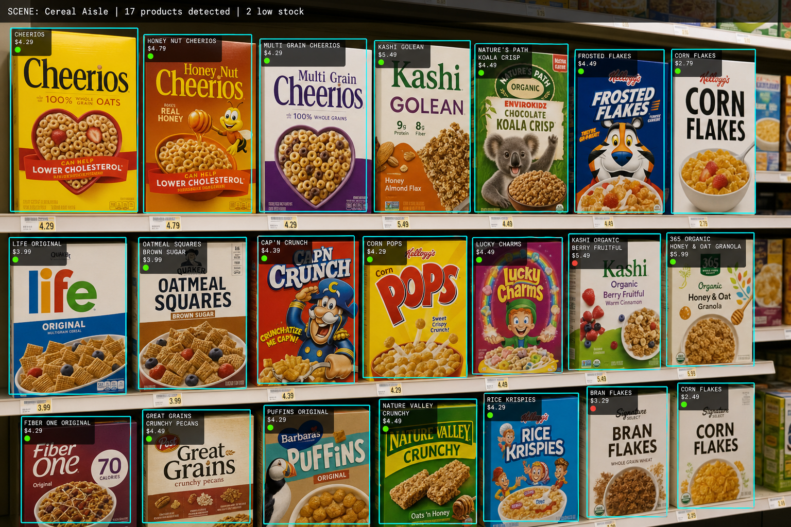
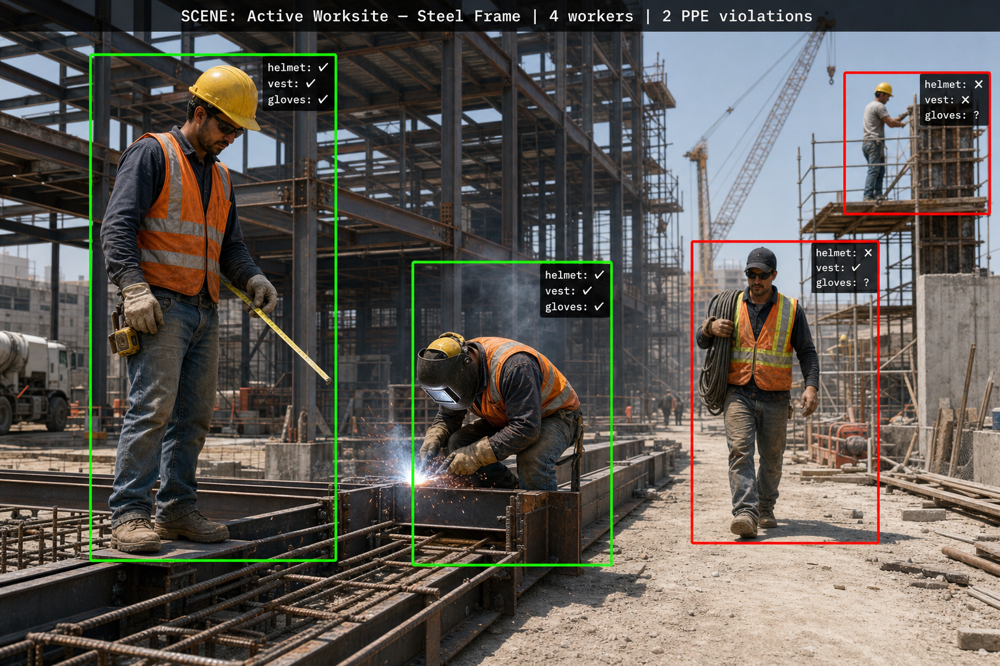
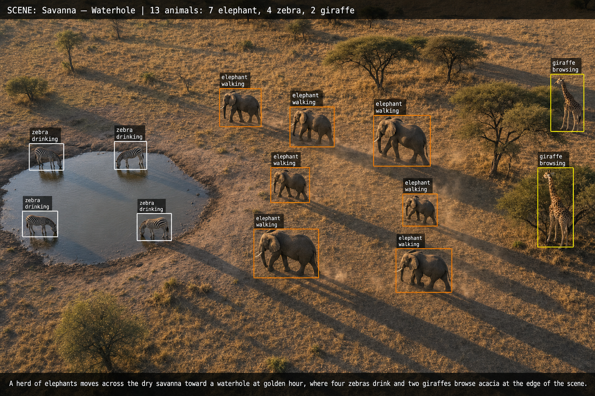

# Florence-2 Unified Perception

> Two related products in one repo: the **Medium-article code** that shows how to expand Florence-2's vocabulary, and the **IMVC 2026 talk recipe** that shows how to use that capability to build a unified multi-task perception model in a single forward pass.

This repo evolved from a narrow code companion into a broader methodology bundle. Pick the half that matches what you came for:

| If you want to... | Go to | Companion writing |
|---|---|---|
| **Add custom tokens to Florence-2 and have a runnable example to adapt** | [`medium_post_code/`](medium_post_code/) | [Medium article — *Expanding Florence-2's Vocabulary*](https://medium.com/@ygal20/expanding-florence-2s-vocabulary-an-advanced-guide-to-adding-custom-tokens-during-fine-tuning-138fab660b64) |
| **Build a unified multi-task perception model end-to-end on your own data** | [`recipe/`](recipe/) | IMVC 2026 talk — *Unified Sports Perception* (Igal Dmitriev & Ofir Liba, WSC Sports) |

The two halves are complementary, not redundant. The article code shows you the **building blocks** (a modified `processing_florence2.py`, a dataset class, a flat-token example). The recipe shows you the **assembled methodology** (a hierarchical token grammar with `<player_N>` blocks, a two-stage surgical fine-tune curriculum, a hierarchical loss, and a worked example of porting the pattern to a non-sports domain).

---

## What you can build with this

**Multi-task perception**, defined precisely for this recipe: a single Florence-2 forward pass that — for one input image — emits *both* a structured token sequence (detections, OCR text, per-entity attributes, scene class) *and* a free-form natural-language description, all natively associated to each other. No second model. No post-hoc joining of a separate detector + OCR engine + captioner. One model, one pass, four heads' worth of output already glued together.

The recipe is sport-flavoured because that's the talk we gave. The methodology is generic. Three quick examples of what "unified perception" looks like in three completely different verticals — same recipe pattern, same one-forward-pass guarantee, only the token vocabulary and the annotation source change:

<table>
<tr>
<td width="33%" align="center"><b>Retail shelf inspection</b></td>
<td width="33%" align="center"><b>Construction PPE compliance</b></td>
<td width="33%" align="center"><b>Wildlife conservation aerial imagery</b></td>
</tr>
<tr>
<td></td>
<td></td>
<td></td>
</tr>
<tr>
<td>Per-product bbox + price OCR + in-/out-of-stock per product + aisle classification.  <em>One forward pass per shelf photo.</em></td>
<td>Per-worker bbox + helmet / vest / gloves attributes per worker + worksite classification.  <em>One forward pass per safety-audit frame.</em></td>
<td>Per-animal bbox + species + behavior + habitat classification + free-text scene description.  <em>One forward pass per drone frame.</em></td>
</tr>
</table>

> Illustrative renders, not real model outputs. The retail adaptation is worked out step-by-step in [`recipe/docs/ADAPT_TO_YOUR_DOMAIN.md`](recipe/docs/ADAPT_TO_YOUR_DOMAIN.md); the construction and wildlife versions follow the same five-step port (rename tokens → redesign the grammar → redefine the scene-class vocabulary → rewrite the schema-compliance regexes → recompute the weighted-loss id-sets).

---

## The end-to-end workflow

The recipe is deliberately built so you spend your time on the things that actually need human judgement (annotation contract, schema design, evaluation criteria) and outsource the boilerplate to a coding assistant:

1. **Build the dataset.** Decide what string you want the decoder to emit for one image (the annotation contract). Write a serialiser that turns your JSON labels into that exact string. Then collect annotations using whatever pipeline fits your budget — hand-labelling, a semi-automated teacher cascade, or existing public datasets stitched together with off-the-shelf models. → [`recipe/docs/DATA_PREPARATION.md`](recipe/docs/DATA_PREPARATION.md)
2. **Provide the spec to your LLM.** Hand the four recipe docs (`TOKENS.md`, `DATA_PREPARATION.md`, `TWO_STAGE_TRAINING.md`, `INFERENCE.md`) plus the worked example to your favourite coding assistant (Cursor, Claude Code, Copilot Workspace, …). The recipe is written so an LLM can scaffold a runnable training script *and* a runnable inference script from the prose alone — that's the entire reason this is a recipe release and not a code release.
3. **Train (two stages).** Stage 1 teaches the grammar (vocabulary alignment, vision encoder frozen, uniform CE). Stage 2 teaches grounding (decoder LoRA on attention projections, hierarchical token-weighted loss). The hard-won numbers — the freezing policy down to the 4 tied parameter pointers, the 8 schema-compliance regex checks, the 19-token content boost, the OCR / HIGH / LOW weight bands, the six knobs worth sweeping — are all in [`recipe/docs/TWO_STAGE_TRAINING.md`](recipe/docs/TWO_STAGE_TRAINING.md).
4. **Inference and parse.** Load the resulting checkpoint with `trust_remote_code=True`, run `generate(..., skip_special_tokens=False)`, parse the token sequence back into the structured fields you started with. → [`recipe/docs/INFERENCE.md`](recipe/docs/INFERENCE.md)

You only ever write one piece of bespoke code: the JSON-to-token serialiser in step 1. Everything else the recipe + your LLM can scaffold.

---

## `medium_post_code/` — the Medium article companion

The original contents of this repo, kept exactly as they were when the article was published.

* `processing_florence2.py` — modified Florence-2 processor with custom tokens (`<emo>`, `<pose>`, `<team>`, `<color>`).
* `custom_caption_dataset.py` — PyTorch dataset class that converts JSON annotations into the new token-augmented captions.
* `example_of_annotations_file.json` — a representative annotation in the **flat schema** the article uses (`character_coordinates`, `emotion`, `pose`, `jersey_color`, ...).
* `README.md` — the article's own walkthrough, with usage examples.

This is the place to start if you have the article open and want a runnable starting point. The schema is intentionally flat (one entity = a dict of attributes) — that's the article's pedagogical scope.

## `recipe/` — the IMVC 2026 talk methodology

The recipe behind the IMVC 2026 talk *Unified Sports Perception*. It picks up where the article leaves off and answers the next question: **once you have custom tokens, how do you organise them into a hierarchy that produces detection, OCR, attribute classification, and a natural-language scene caption in one forward pass?**

* [`recipe/README.md`](recipe/README.md) — landing page; explains why a recipe (not a code release).
* [`recipe/docs/DATA_PREPARATION.md`](recipe/docs/DATA_PREPARATION.md) — the hierarchical annotation contract and the exact token string the model learns to emit.
* [`recipe/docs/TOKENS.md`](recipe/docs/TOKENS.md) — which custom tokens to add and the registration pattern that doesn't silently break.
* [`recipe/docs/TWO_STAGE_TRAINING.md`](recipe/docs/TWO_STAGE_TRAINING.md) — the surgical two-stage curriculum (vocabulary alignment, then decoder LoRA + hierarchical loss).
* [`recipe/docs/INFERENCE.md`](recipe/docs/INFERENCE.md) — load → generate → parse → denormalise.
* [`recipe/docs/ADAPT_TO_YOUR_DOMAIN.md`](recipe/docs/ADAPT_TO_YOUR_DOMAIN.md) — a worked retail-shelf example plus a 7-domain table of where the same pattern fits.

The recipe is intentionally **prose-first**: only two short Python snippets across all five docs (the token-registration block and the LoRA-injection pattern). Everything else is instructions you can read yourself or hand to a coding assistant to scaffold on your own data.

---

## How the two halves relate

The article and the talk are two points on the same arc:

* **Article (`medium_post_code/`):** *"Florence-2's vocabulary is fixed at pretraining. Here's how to add new tokens without breaking the embeddings or the lm_head."* Demonstrates with a flat token set (`<emo>`, `<pose>`, …) and one entity per "character".

* **Talk (`recipe/`):** *"OK, now that we can add tokens — what tokens, in what order, and how do we train the model to use them?"* Answers with a hierarchical grammar (`<player_N>...</player_N>` blocks containing `<bbox>` and `<ocr>` + polygons), a two-stage curriculum that decouples grammar learning from visual grounding, and a hierarchical loss that weights structural and OCR tokens correctly.

Read the article first if you've never touched Florence-2's tokenizer. Read the recipe first if you want to ship a production multi-task perception model.

---

## What this repo does NOT provide

* No pre-trained model weights. The recipe is the methodology; you train on your own data.
* No installable package. The recipe is prose + two illustrative snippets; the article code is a small handful of files you copy and adapt.
* No hosted inference. Bring your own GPU.

This is intentional. The value is in the decisions (which tokens, what grammar, what to freeze, which loss) — those transfer to any domain. A frozen model wouldn't.

---

## License

[MIT](LICENSE) — © 2025-2026 Igal Dmitriev and Ofir Liba. You can quote, fork, adapt, and reuse both the code and the prose freely, as long as the copyright notice is preserved.

---

## Get in touch

Tried this on your data? Got it working on a non-sports domain? Stuck on Stage 2? Open an issue on this repo or ping [Igal on LinkedIn](https://www.linkedin.com/in/igal-dmitriev-34293522) — we genuinely want to know which multi-task perception problem this pattern unlocks for you.
