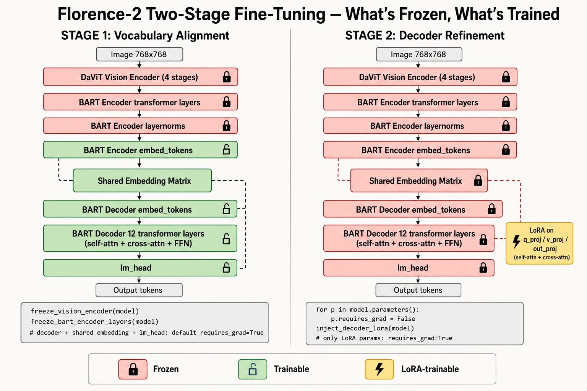

# The two-stage training curriculum

## Why two stages, not one

Single-shot fine-tuning Florence-2 on the hierarchical token sequence conflates two very different learning problems:

1. **Grammar** — what tokens come in what order. The model must learn that `<bbox>` is always followed by exactly 4 `<loc_*>` and a `</bbox>`, that `<ocr>` is always followed by text and then 8 `<loc_*>`, that `<player_N>` must close with `</player_N>`, etc.
2. **Grounding** — which pixels each token refers to. Bounding boxes must align with actual entities, OCR text must match jersey numbers, the scene class must match the visual context.

If both happen at once the gradients fight each other. The decoder invents grammar while the cross-attention is being asked to point at specific pixels, the vision encoder is pulled away from its pretrained representation in service of the grammar, convergence is slow, and on small datasets you simply never converge to a coherent output.

**The fix is to decouple.** Stage 1 teaches the grammar with the vision encoder fully frozen. Stage 2 teaches grounding via decoder-only LoRA, with the vision encoder still frozen — the decoder learns *where to look* in the unchanged visual features.

## Why two stages and not three

The full production pipeline (the one shown in the talk) adds **Stage 3**: surgical LoRA on the late DaViT vision stages (1/16 and 1/32 resolution) at a very low LR, to nudge the visual representation for the specific domain. We deliberately leave Stage 3 out of this recipe because:

* Florence-2's FLD-5B pretraining is already excellent on sports and general scenes. Stage 3 buys 2-4% accuracy at the cost of considerably more engineering and a real risk of corrupting the visual generalisation that lets the same weights work on unseen leagues.
* Two stages get you 90% of the quality with a fraction of the work.
* If you need Stage 3 later, the recipe accommodates it cleanly — it's another freeze-then-LoRA cycle, this time targeting attention projections inside the late vision blocks. Same pattern as Stage 2.

If you have a strong reason to drift the visual representation — radically different visual domain (medical microscopy, satellite imagery, etc.) — add Stage 3. Otherwise don't.

---

## Visual orientation — what's frozen, what's trained

Before the per-stage details, here is the whole story in one diagram. Both columns show the same Florence-2 architecture top-to-bottom; only the colour of each box changes between stages.



**The logic behind this freezing pattern** — three decisions explain almost everything:

1. **The vision encoder is *never* trainable in this recipe.** Florence-2's DaViT was pre-trained on FLD-5B (a vast visual corpus) and already separates entities, jersey-like patches, scene context, and text-bearing regions extremely well for natural images. Letting the vision encoder drift in the service of grammar learning (Stage 1) or grounding (Stage 2) is a recipe for catastrophic forgetting — the model gets better on your training distribution and worse on every league, lighting condition, or sport you haven't seen. Stage 3 of the production curriculum (deliberately omitted here) does adapt the late DaViT stages with surgical LoRA, but only when the visual domain is genuinely different from natural images.

2. **Stage 1 makes the new vocabulary part of the model.** The freshly-registered custom tokens (`<MULTIMODAL_VISUAL_CAPTION>`, `<stype>`, `<team>`, all the `<player_N>` pairs, etc.) start with random-ish initialisations — they have no semantic content. To learn good embeddings for them, the shared embedding matrix must be **trainable**, and because Florence-2 ties four pointers to that one matrix (`encoder.embed_tokens`, `decoder.embed_tokens`, `model.shared`, `lm_head`), training the shared matrix automatically trains the lm_head too. The full decoder is also trainable in Stage 1 because the decoder has to learn the *grammar* — what tokens come in what order — and that requires real plasticity, not just adapter-sized capacity. Only the encoder layers and layernorms are frozen, so the encoder doesn't drift while the decoder learns its new vocabulary.

3. **Stage 2 makes the new vocabulary visually grounded — cheaply.** After Stage 1 the model can emit syntactically valid output but the boxes/OCR may point at the wrong things. Stage 2 fixes this with tiny LoRA adapters on the decoder's attention projections — and *only* those projections, because cross-attention is the mechanism by which the decoder "looks at" the (frozen) visual features. Everything else is frozen so the Stage 1 vocabulary alignment is locked in. Only ~0.3% of parameters end up trainable. This stage is fast, hard to overfit, and the resulting LoRA can be merged back into the base linear weights at save time for zero-overhead inference.

The `freeze_*` helper names in the diagram (`freeze_vision_encoder`, `freeze_bart_encoder_layers`, `inject_decoder_lora`) are short utility functions you implement once and reuse across both stages — see each stage's *"How freezing actually works"* paragraph below for the exact pattern.

---

## Compute, precision, and memory

The reference recipe runs in **plain fp32 with no gradient checkpointing**. On Florence-2-large at 768×768 input resolution this fits a batch of 16 on a single A100-40GB; on a 24 GB card you almost certainly need either bf16 autocast, gradient checkpointing, or both. Three knobs that reclaim a lot of VRAM without changing anything about the recipe:

| Knob | One-liner | Typical memory saving | Trade-off |
|---|---|---|---|
| bf16 mixed precision | Wrap the forward + backward in `with torch.autocast(device_type="cuda", dtype=torch.bfloat16):`. No `GradScaler` needed for bf16 (only fp16 needs it). | ~30-50% activations; further savings if you also keep weights in bf16 | Slightly noisier loss; rarely matters for fine-tuning. **Prefer bf16 over fp16** — BART-family decoders are known to be fp16-unstable on long target sequences (the schema's full token sequence is routinely 800-1200 tokens). |
| Gradient checkpointing | `model.gradient_checkpointing_enable()` after the model loads, *and* set `model.config.use_cache = False` (the two are incompatible during training). | ~30-50% activations | ~20% slower step time. Re-enable `use_cache = True` before inference or generation gets dramatically slower. |
| Lower batch size + grad accumulation | Halve `BATCH_SIZE`, set `GRAD_ACCUM_STEPS = 2`. The effective batch is unchanged; the per-step loss curve is identical. | Linear with the batch reduction | Slightly slower wall-clock per gradient update. The cheapest knob to try first because it requires zero precision changes. |

None of the three changes the recipe's hyper-parameters, freezing policy, weighted loss, or early-stop criterion — they only change how the same forward / backward fits in your hardware. Pick the smallest combination that lets your batch size match what the recipe assumes (`16` in Stage 1, `8` in Stage 2).

---

## Stage 1 — Vocabulary alignment

### Freezing policy

The notation "**frozen**" below means `param.requires_grad = False`. Florence-2 **ties four parameter pointers to one weight matrix** — `model.shared`, `encoder.embed_tokens`, `decoder.embed_tokens`, and `lm_head` all share the same underlying tensor — so the table treats each pointer as its own row to make the tie explicit.

| Component | Stage 1 |
|---|---|
| DaViT vision encoder (`model.vision_tower`) | **frozen** |
| BART encoder transformer layers (`encoder.layers`) | **frozen** |
| BART encoder layernorms (`layernorm_embedding`, final `layer_norm`) | **frozen** |
| BART encoder `embed_tokens` | **trainable** (tied) |
| Shared embedding (`model.language_model.model.shared`) | **trainable** — the rows for the new custom tokens need to learn |
| BART decoder `embed_tokens` | **trainable** (tied) |
| BART decoder layers (self-attn, cross-attn, FFN, layernorms) | **trainable** (full fine-tune) |
| `lm_head` | **trainable** (tied) |

**How freezing actually works in Stage 1.** Because the shared embedding is trainable and `lm_head` shares its weight tensor by tying, training one trains all four pointers. You do not have to chase pointers individually — you only need to freeze the things that are *not* tied to the shared matrix:

```python
freeze_vision_encoder(model)         # vision_tower.parameters().requires_grad = False
freeze_bart_encoder_layers(model)    # encoder.layers + layernorm_embedding + final layer_norm
                                     #   -- explicitly does NOT touch encoder.embed_tokens
# Decoder layers, shared embedding, decoder embed_tokens, lm_head: default requires_grad = True
```

The two helpers above are 3-5 lines each — implement them yourself (or have your LLM scaffold them from the freezing-policy table). The critical detail is that `freeze_bart_encoder_layers` walks `encoder.layers` and the two layernorms but **leaves `encoder.embed_tokens` untouched**, because that parameter is tied to `model.shared` and freezing it would also freeze the lm_head and the decoder's `embed_tokens` — defeating the whole point of Stage 1.

### Loss

Uniform cross-entropy. **Do not weight tokens in Stage 1** — biasing the loss before the model knows the grammar slows convergence and produces uneven token-level errors.

### Early stop

Every `EVAL_STEPS = 100` training steps (same cadence as the validation-loss eval), generate on the first **50** validation images and compute a **schema-compliance rate** — the fraction of generations whose token sequence parses against the expected grammar. When that rate reaches **≥ 0.95**, Stage 1 exits.

**The eight per-output checks.** All eight must pass for a single generation to count as compliant (boolean AND — not a weighted score, not a K-of-N threshold):

| # | Check | Regex / rule | What it catches |
|---|---|---|---|
| 1 | `has_stype` | `<stype>[^<]+` | `<stype>` is present with non-empty content before the next tag |
| 2 | `has_nath` | `<nath>\d+` | `<nath>` is followed by an integer |
| 3 | `has_gdesc` | `<gdesc>.+` | `<gdesc>` has at least one character of description after it |
| 4 | `has_eos` | `</s>` is present | The sequence terminates with EOS (an un-terminated sequence is broken even if everything before it parses) |
| 5 | `has_player_block` | `<player_\d+><bbox><loc_\d+>{×4}</bbox>` | At least one player block opens with the canonical 4-loc bbox shape |
| 6 | `player_blocks_closed` | `set(<player_N>) == set(</player_N>)` | Every player block that opens also closes (set equality on the indices) |
| 7 | `has_ocr_format` | conditional: if `<ocr>` appears anywhere, at least one `<ocr>{TEXT}<loc_\d+>{×8}` must match | OCR polygons have all 8 loc tokens (not 4, not 6). Skipped entirely when no `<ocr>` is in the generation. |
| 8 | `nath_consistent` | `int(<nath>N) == count(<player_*>)` | The integer after `<nath>` equals the number of opened player blocks — the schema's only cross-field integrity check |

**Edge case — no-player scenes.** When `<nath>0` is generated, checks 5 and 6 are auto-passed (there are no players, so there are no player blocks to find or close). Without this carve-out, an empty-stadium image would be permanently incompliant.

**Generation config used by the check.** These settings affect the compliance number; if you change them the threshold is no longer comparable:

```python
gen_ids = model.generate(
    input_ids=inputs["input_ids"],
    pixel_values=inputs["pixel_values"],
    max_new_tokens=1024,
    num_beams=3,
)
texts = processor.batch_decode(gen_ids, skip_special_tokens=False)  # MUST be False
```

`skip_special_tokens=False` is non-negotiable — the entire schema is built from special tokens; with the default `True` you'd be regex-matching against empty strings and every check would fail.

**Aggregation.** `compliant_count / total_count` over the first 50 validation samples encountered. In DDP, only rank 0 runs the check; the boolean `>= 0.95` decision is broadcast to every rank to prevent deadlock. In practice the rate climbs past 0.95 within 1-2 epochs on a few thousand annotations.

**Why this metric and not validation loss?** A model can have a beautifully decreasing cross-entropy loss while still producing structurally broken sequences (one missing `</player_2>` tag silently shifts every downstream parser by one player). The schema-compliance rate catches that immediately; the loss does not.

### Other validation metrics (every `EVAL_STEPS = 100` steps)

Schema compliance is the **stopping signal** — it tells you "the model has learnt the grammar, move on." It is not a shipping signal. Alongside it, every validation pass also computes four content-quality metrics. None of them gates Stage 1 exit, but all of them are what you actually look at to decide "is this model good enough for production?". They are computed for both stages, on the same val loader, with the same generation config (`max_new_tokens=1024, num_beams=3, skip_special_tokens=False`).

| Metric | Definition | Reasonable target by end of Stage 2 |
|---|---|---|
| Validation loss (token-weighted CE) | The same weighted loss used at train time, recomputed on val. Strongly affected by the per-token weights — **not** directly comparable across sweeps that change the weights. | Decreasing monotonically; flat plateau = stop. |
| Player count accuracy | Fraction of val samples where the integer after `<nath>` equals the number of `<player_N>` blocks in the same generation. Probes the same cross-field consistency that schema check 8 enforces, but on real predictions instead of a regex pass/fail. | ≥ 0.95 |
| Per-digit accuracy on jersey numbers | For each `<ocr>` block whose text is purely numeric, average per-position digit accuracy against the GT text. Robust to length differences (a 2-vs-3-digit miss is still scored on the shared digits). | ≥ 0.90 |
| Character Error Rate (CER) on OCR text | Edit distance ÷ GT length, averaged across all `<ocr>` blocks. | Single digits (`<10%`) on jersey numbers; mid-double-digits on long ad-board text. |
| Scene-type accuracy + 9×9 confusion matrix | Exact-string match of the generated `<stype>` value against GT, with the confusion matrix computed offline. The matrix is more informative than the headline accuracy — it tells you which two classes are colliding (commonly: `Warm-ups` vs `In-Game`, or `Press Conference` vs `Interview`). | ≥ 0.85 headline; no off-diagonal cell > 10% |

The first four are logged every `EVAL_STEPS` steps. The scene-type confusion matrix is a separate offline script (it doesn't need to fire every 100 steps), but you'll want to look at it at least once per stage.

**There is no detection mAP in this recipe.** Bounding boxes are evaluated implicitly via the weighted loss and qualitatively by eyeballing generated samples. If you need a hard detection number, post-process the generated `<bbox>` + `<loc_*>` blocks into a standard detection format and run COCO-style mAP offline — but be aware that token-space generation rarely matches a dedicated detector's mAP, and that's not what this recipe is optimising for.

### Hyper-parameters that matter

| Knob | Suggested | Why |
|---|---|---|
| Learning rate | `5e-5` | Larger LR destabilises the new token embeddings. |
| Warmup | 10% linear | Gives the freshly-added embedding rows time to find direction before the LR peaks. |
| Batch size | `16` (Florence-2-large, 24 GB) | Halve if you OOM on a smaller GPU. |
| Epochs | `3` (cap) | With early-stop, you almost always finish in 1-2. |
| Schema-compliance threshold | `0.95` | Higher = stricter early-stop = more epochs. |

### What "done" looks like

Schema-compliance metric climbing past 95% within 1-2 epochs. Validation loss converging around 0.3-0.6 (varies by dataset size). At that point the checkpoint is a clean Hugging Face folder (model + processor + the expanded tokenizer + Florence-2's custom `.py` files) — load it with a plain `AutoModelForCausalLM.from_pretrained(..., trust_remote_code=True)`.

---

## Stage 2 — Decoder refinement (LoRA + hierarchical loss)

### Freezing policy

Same notation as Stage 1 — "**frozen**" means `param.requires_grad = False`. Stage 2 freezes *everything* in the base model and only the freshly-injected LoRA `lora_A` / `lora_B` parameters end up trainable.

| Component | Stage 2 |
|---|---|
| DaViT vision encoder (`model.vision_tower`) | **frozen** |
| BART encoder (layers + layernorms + `embed_tokens`) | **frozen** |
| Shared embedding (`model.language_model.model.shared`) | **frozen** — locks the Stage 1 vocabulary alignment |
| BART decoder `embed_tokens` | **frozen** (tied) |
| BART decoder `embed_positions` | **frozen** |
| `lm_head` | **frozen** (tied) |
| BART decoder base weights (self-attn, cross-attn, FFN, layernorms) | **frozen** |
| LoRA on decoder self-attention (q_proj, v_proj, out_proj) | **trainable** |
| LoRA on decoder cross-attention (q_proj, v_proj, out_proj) | **trainable** |

Only ~0.3% of all parameters are trainable. Forward / backward is correspondingly cheap.

**How freezing actually works in Stage 2.** You do not need a separate `freeze_embeddings` helper for Stage 2 — the LoRA injection block (shown below) starts with `for p in model.parameters(): p.requires_grad = False`, which freezes everything atomically: the entire vision encoder, the BART encoder, **all 4 tied pointers** (shared, encoder.embed_tokens, decoder.embed_tokens, lm_head), `embed_positions`, the decoder layers — every parameter in the model. Only the newly-created `LoRALinear.lora_A` and `LoRALinear.lora_B` end up `requires_grad=True` after injection, because they were just instantiated and inherit the PyTorch default.

If you prefer defensive explicitness, you can still call a separate `freeze_embeddings(model)` helper after the LoRA injection — it'll be a no-op because the tied pointers are already frozen, but it makes intent visible to anyone reading the training script.

### Why decoder cross-attention specifically

Self-attention LoRA helps the decoder reason about token-to-token consistency (closing `<player_N>` correctly, putting OCR after bbox, etc.).

**Cross-attention LoRA is the real lever.** The decoder cross-attends from the token sequence into the (frozen) visual feature map. Adapting cross-attention is how the decoder learns *where to look* in the visual features for jersey numbers, scene context, team colours — without changing the visual features themselves. This is the entire spatial-binding mechanism from the talk.

### Loss — token-weighted cross-entropy with two boosts

Per-token weighted CE with three weight classes and two on-top boosts:

| Token class | Suggested weight | Examples |
|---|---|---|
| HIGH | `5.0` | `<bbox>`, `</bbox>`, `<player_N>`, `</player_N>`, `<stype>`, `<nath>`, `</s>`, all `<loc_*>` |
| OCR (highest) | `12.0` | `<ocr>` and the content tokens that follow it (jersey-number text + 8 `<loc_*>`) |
| LOW | `0.7` | `<gdesc>` and the long natural-language span after it |
| Default | `1.0` | Everything else |

**Building the per-token weight tensor.** The weights above are per-token-*class*, but cross-entropy applies them per-token-*id*. You need to convert each class's token names into integer ids using the loaded (and registration-completed) tokenizer, then build the weight mask per batch by table-lookup against the labels. The full pattern is short:

```python
# ---- Once, after the tokenizer has the custom tokens registered (see TOKENS.md): ----
vocab = tokenizer.get_vocab()

HIGH_IDS = {vocab[t] for t in ("<bbox>", "</bbox>", "<stype>", "<nath>", "</s>") if t in vocab}
HIGH_IDS |= {vocab[f"<player_{i}>"]  for i in range(1, 9) if f"<player_{i}>"  in vocab}
HIGH_IDS |= {vocab[f"</player_{i}>"] for i in range(1, 9) if f"</player_{i}>" in vocab}
HIGH_IDS |= {vocab[f"<loc_{i}>"]     for i in range(1000) if f"<loc_{i}>"     in vocab}   # the 1000 location bins

OCR_IDS              = {vocab["<ocr>"]}
LOW_IDS              = {vocab["<gdesc>"]}
CONTENT_TRIGGER_IDS  = {vocab["<ocr>"], vocab["<stype>"]}   # tokens that open a boosted content span

# ---- Per batch, inside the loss forward: ----
weights = torch.ones_like(labels, dtype=torch.float32)              # default = 1.0
for tid in HIGH_IDS: weights[labels == tid] = HIGH_WEIGHT            # 5.0
for tid in OCR_IDS:  weights[labels == tid] = OCR_WEIGHT             # 12.0  (trigger itself; content boost extends this)
for tid in LOW_IDS:  weights[labels == tid] = LOW_WEIGHT             # 0.7
# ... then layer the content + positional boosts (next two bullets) on top of `weights` ...
weights[labels == IGNORE_INDEX] = 0.0                                # mask padding (the standard -100 sentinel)

per_token_ce = F.cross_entropy(logits.flatten(0, 1), labels.flatten(), reduction="none", ignore_index=IGNORE_INDEX)
loss = (per_token_ce * weights.flatten()).sum() / weights.flatten().sum().clamp(min=1.0)
```

**Three pitfalls in this construction that will silently corrupt training:**

* **Don't prefix-match on token strings.** Use exact dictionary lookups (`vocab[token]`) and verify each lookup succeeds. Substring matches on `<player_` will conflate `<player_1>` with `<player_10>` (if you ever raise `MAX_PLAYER_INDEX`); substring matches on `<loc_` will conflate `<loc_1>` with `<loc_100>`. Wrong ids in the id-sets means wrong tokens get weighted, which is undetectable by every standard training-loss curve.
* **Don't cache the id-sets across a tokenizer change.** If you add or remove any custom token (a new `<player_9>`, a new attribute token, etc.) you must (a) re-run the registration block in [`TOKENS.md`](TOKENS.md), (b) re-load the model + processor from the new snapshot, and (c) **rebuild these id-sets from the new tokenizer**. The string-to-id mapping changes after every `add_special_tokens` call.
* **Don't assume `<loc_*>` ids are contiguous.** Florence-2 happens to assign them contiguously today, but the canonical source of truth is the dictionary lookup. Iterating with `range(loc_0_id, loc_999_id + 1)` will break the moment the underlying tokenizer is rebuilt or you swap in a different base model.

Two boosts layered on top:

* **Content boost — `CONTENT_BOOST_LENGTH = 19`, hard cutoff, with early span-breaker termination.** Two triggers open a boosted span, but they apply different weights inside it:

  | Trigger | Weight inside the boosted span | Typical span contents |
  |---|---|---|
  | `<ocr>` | `OCR_WEIGHT` (e.g. `12.0`) | The literal jersey-number / OCR text (1-3 BPE pieces) immediately followed by 8 polygon `<loc_*>` tokens. ~9-11 tokens total in the common case. |
  | `<stype>` | `HIGH_WEIGHT` (e.g. `5.0`) | The scene-class string after `<stype>` (1-3 BPE pieces, e.g. `In-Game`, `Interview`). |

  **Where does 19 come from?** A typical OCR span is ≤ 11 tokens (text + 8 locs); 19 gives ~2× safety margin for unusually long content — a multi-word ad-board, a 4-digit serial number that BPE splits into 4 pieces, a multi-word scene type. Pick a different value if your domain has longer OCR text (rule of thumb: 1.5-2× the longest OCR span you want to weight aggressively). Smaller is safer (the boost stops sooner if it ever over-runs into structural tokens); larger only matters when your content tokens are unusually long.

  **Span breakers** that terminate the boost before the 19-token cap is hit, on first occurrence:
  - any `<player_N>` or `</player_N>` (the per-player block boundary)
  - `<gdesc>` (the start of the free-form description)
  - for the `<ocr>` trigger only: another `<ocr>` — a new OCR span starts with its own fresh 19-token budget

  **The boost uses `max(existing_weight, boost_weight)`, not plain assignment.** A `<loc_*>` token inside an OCR polygon already has `HIGH_WEIGHT` (5.0) from the class lookup; the OCR boost raises it to `OCR_WEIGHT` (12.0). A `<loc_*>` inside a `<bbox>` (no active boost) stays at `HIGH_WEIGHT`. Using plain assignment instead of `max()` would silently *lower* the weight of structural tokens that happen to fall inside a non-OCR boosted span — a bug invisible in every training-loss curve.

* **Positional boost.** Tokens inside `<player_N>` get scaled by `1 + (N - 1) * rate`. With `rate = 0.4`: player 1 = 1.0×, player 5 = 2.6×, player 8 = 3.8×. Later players are harder (cross-attention degrades by position in the sequence); the boost compensates.

### The LoRA-injection pattern

Stage 2's pipeline is: load the Stage 1 checkpoint → freeze everything → inject LoRA into the decoder's self- and cross-attention → optimise only the LoRA parameters. The injection is the only non-trivial piece — here is the minimal pattern:

```python
import math, torch, torch.nn as nn

class LoRALinear(nn.Module):
    """Wraps a frozen nn.Linear with a trainable low-rank delta."""
    def __init__(self, original: nn.Linear, rank: int = 16, alpha: float = 32.0, dropout: float = 0.05):
        super().__init__()
        self.original = original
        self.scaling  = alpha / rank
        self.lora_A   = nn.Parameter(torch.empty(rank, original.in_features))
        self.lora_B   = nn.Parameter(torch.zeros(original.out_features, rank))   # zero -> identity at init
        nn.init.kaiming_uniform_(self.lora_A, a=math.sqrt(5))
        self.drop     = nn.Dropout(dropout) if dropout > 0 else nn.Identity()
        self.original.weight.requires_grad = False
        if self.original.bias is not None:
            self.original.bias.requires_grad = False

    def forward(self, x):
        return self.original(x) + self.drop(x) @ self.lora_A.T @ self.lora_B.T * self.scaling


def inject_decoder_lora(model, rank=16, alpha=32.0, dropout=0.05) -> int:
    """Wrap every q_proj / v_proj / out_proj in BART decoder self- AND cross-attention."""
    for p in model.parameters():
        p.requires_grad = False                                                  # freeze everything first
    decoder = model.language_model.model.decoder
    count = 0
    for layer in decoder.layers:
        for attn_name in ("self_attn", "encoder_attn"):                          # encoder_attn == cross-attn
            attn = getattr(layer, attn_name, None)
            if attn is None: continue
            for proj_name in ("q_proj", "v_proj", "out_proj"):                   # NOT k_proj
                orig = getattr(attn, proj_name)
                setattr(attn, proj_name, LoRALinear(orig, rank=rank, alpha=alpha, dropout=dropout))
                count += 1
    return count   # ~72 wrapped projections on Florence-2-large
```

After injection, build the optimizer over `[p for n, p in model.named_parameters() if "lora_" in n]` only.

At save time, merge each `LoRALinear` back into a plain `nn.Linear` (`W ← W + (B @ A) * scaling`), then `save_pretrained`. The resulting checkpoint is a clean Hugging Face model — no LoRA library needed at inference.

### Hyper-parameters that matter

| Knob | Suggested | Why |
|---|---|---|
| Learning rate | `1e-4` | Higher than Stage 1 because we're training tiny LoRA adapters, not big embeddings. |
| LoRA rank | `16` | Sweet spot — `r=4` underfits, `r=32` adds compute without quality gain. |
| LoRA alpha | `32.0` | Standard scaling = α / r = 2.0. |
| LoRA dropout | `0.05` | Keep small; LoRA already regularises. |
| Batch size | `8` | Smaller than Stage 1 because the weighted-loss bookkeeping is memory-heavy. |
| Epochs | `5` | Larger datasets benefit from 7-10; LoRA at `r=16` rarely overfits. |
| OCR token weight | `12.0` | Don't drop below 8 unless your OCR text is large and easy to read. |
| Positional boost rate | `0.4` | Drop to `0.15-0.2` if you have ≤ 4 entities; the boost grows quickly with player index. |

### What "done" looks like

Validation loss decreasing slowly over 3-5 epochs. Generation samples on the validation set look right — boxes tighten, OCR text is correct, the scene-description text is coherent. CER on jersey numbers drops to single digits.

If Stage 2's loss explodes after warmup, lower the OCR token weight from 12 to 8 — on noisy annotations the loss is sometimes dominated by one mis-predicted OCR span.

---

## Resume / restart cookbook

| Situation | What to do |
|---|---|
| Fresh start | Run Stage 1 on the base Florence-2 with custom tokens enabled, then Stage 2 on the Stage-1 best checkpoint. |
| Stage 1 succeeded, want to sweep Stage 2 hyper-params | Re-run only Stage 2, pointing at the same Stage-1 best checkpoint. |
| Stage 2 plateaued / regressed | Fall back to the Stage-1 best checkpoint, lower LR or OCR token weight, retry Stage 2. |
| Token list changed | **Re-run Stage 1 from base Florence-2.** Adding or removing tokens after Stage 1 corrupts the new embedding rows. |
| Dataset grew | Just re-run both stages — the curriculum is fast enough that re-training from scratch is cleaner than incrementally fine-tuning. |

---

## Knobs worth sweeping when the baseline isn't quite enough

The defaults above produce a working model. Once it's running and you want to push further (or you've ported the recipe to a new domain and need to re-tune), six knobs cover roughly 80% of the practical sweep budget. The remaining knobs — warmup ratio, weight decay, gradient clip, LoRA dropout, LoRA alpha — almost never produce the biggest wins; touch them only after the six below have been ruled out.

| # | Knob | Default | Range to try | Direction | When to reach for it |
|---|---|---|---|---|---|
| 1 | Stage 2 learning rate | `1e-4` | `5e-5` … `3e-4` | Higher = faster LoRA fitting, more risk of forgetting Stage 1 grammar. Lower = safer, slower. | Stage 2 val loss plateaus high → try `2-3e-4`. Stage 2 schema-compliance drops mid-training (forgetting) → try `5e-5`. |
| 2 | LoRA rank (Stage 2) | `16` | `{4, 8, 16, 32}` | Higher = more decoder capacity per attention projection, slower step, mild overfitting risk on small datasets. | Dataset < 3K samples → drop to `8` (or even `4`). Dataset 20K+ and Stage 2 underfits (val loss flat from epoch 2) → try `32`. |
| 3 | OCR token weight | `12.0` | `8.0` … `15.0` | Higher = OCR text gets more loss attention; can crowd out grammar tokens. Lower = OCR accuracy drops, structure stays cleaner. | Stage 2 loss explodes after warmup → drop to `8`. Jersey-number CER stuck in double digits while schema compliance is already > 0.95 → push to `15`. |
| 4 | Positional boost rate | `0.4` | `0.15` … `0.4` | Higher = later-indexed players (player_5…player_8) get aggressively boosted; loss can be dominated by one mis-predicted late player. | ≤ 4 entities per image on average → drop to `0.15-0.2`. The boost ramps up quickly with player index and a `0.4` rate on a 2-entity dataset just amplifies noise. |
| 5 | Schema-compliance threshold (Stage 1 early-stop) | `0.95` | `0.85` … `0.98` | Higher = stricter Stage 1 exit; more epochs spent on the last few percent of compliant generations. Lower = exit sooner, risk shipping a partially-broken grammar into Stage 2. | Stage 1 never reaches `0.95` (plateaus at `0.88-0.92`) on noisy data → drop to `0.85` and let Stage 2 weighted-loss fix the rest. Stage 2 has trouble converging because the input checkpoint emits the occasional malformed sequence → raise to `0.98`. |
| 6 | Weighted-sampling strategy | `ocr_boost` | `{inverse_freq, linear, difficulty_based, ocr_weighted, ocr_boost}` | Each strategy reshapes the training distribution. `ocr_boost` aggressively over-samples OCR-rich images; `inverse_freq` over-samples rare player counts (1-player and 7+ player); `difficulty_based` focuses the 4-7 player middle range. | OCR CER is the bottleneck → `ocr_boost`. Few-player and many-player scenes both look bad while the middle is fine → `inverse_freq`. The 4-7 player middle is the weakest → `difficulty_based`. Headline metrics are balanced and you just want a sanity baseline → `linear`. |

**How to sweep without burning compute.** Sweep one knob at a time (never a grid — multiplicative cost, additive insight), keep all others at their defaults, and short-train each variant for the smallest number of steps that gets Stage 2 past warmup (~ 30% of the full epoch budget). A bad variant is identifiable that early; full runs are only needed for the 1-2 finalists.

**Which validation metric to compare on.** Pick the one that matches your bottleneck *before* you start the sweep — they don't always agree:

* Schema compliance plateau → use the schema-compliance rate from [§ Early stop](#early-stop).
* OCR / jersey-number accuracy plateau → use CER and per-digit accuracy from [§ Other validation metrics](#other-validation-metrics-every-eval_steps--100-steps).
* Scene classification confusion → use the 9×9 scene-type confusion matrix.
* Generic "the model just feels worse" → token-weighted val loss, with the caveat from § Other validation metrics that it's not comparable across sweeps that change the loss weights themselves (knob 3 above).
